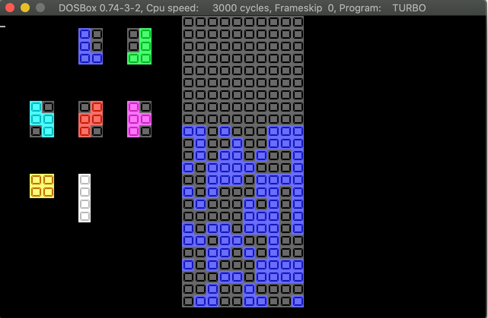

# PASCAL

This is where my memories live, what I coded in High school 1998-2000.

## To run my code

1. Having DOS simulator program. For example [DOSBox](https://www.dosbox.com/)
2. Copy and rename `PASCAL` folder to `C:\TP`
3. Mount and Run `TURBO.EXE` in `C:\TP\BIN`

Open any runable code file, press `Alt+F9` to compile, `Ctrl+F9` to run. Good luck!

## Some of my favourite code

### DOS Font Designer

I love custom DOS-mode font to build games or Vietnamese language enabled programs. So I built a font designer program which use mouse and graphic mode to design characters in grid mode.

### Tetris DOS game

I lost my final fully functioning game's code. This is a screenshot of game development in progress. It was a surprisingly good game that I spent many hours enjoy playing it.

The graphic was created in DOS-mode using my previous Font Designer program.

### Hamilton Algorithm implementation

I love coding algorithms, too. This is one of many:

